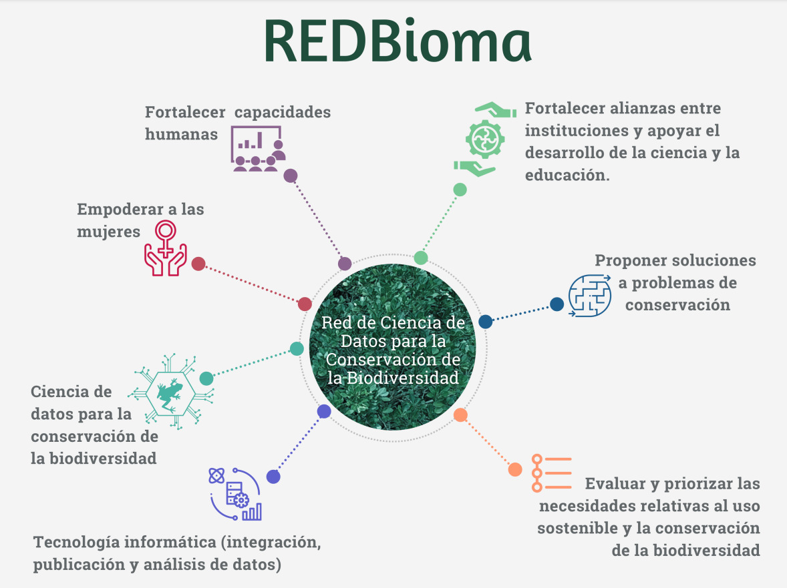

## Sobre la red

El objetivo de la red es proponer soluciones a problemas de la conservación mediante ciencia de datos, con un fuerte componente de fortalecimiento de capacidades y empoderamiento de mujeres de la región.
  
Este proyecto permitirá fortalecer alianzas entre instituciones de la región mesoamericana, conocer algunas de las necesidades de las personas participantes asociadas al uso sostenible y la conservación de la biodiversidad, implementar un portal de datos abiertos que integre datos e información sobre biodiversidad y fortalecer capacidades en temas de ciencia de datos para apoyar así el desarrollo de la ciencia, la educación y la conservación de la biodiversidad dando prioridad a los grupos más vulnerables de la población mesoamericana.

### Objetivos

<b>General</b>
 
Establecer una red mesoamericana de observadores e investigadores en biodiversidad para proponer soluciones a problemas
de la conservación mediante ciencias de datos, con un fuerte componente de fortalecimiento de capacidades y empoderamiento
de mujeres de la región.

 

 

<b>Objetivos Específicos</b>
 

<ul>
<li>Establecer una red mesoamericana de observadores e investigadores de la biodiversidad para fortalecer alianzas entre instituciones de la región y apoyar así el desarrollo de la ciencia, la educación y la conservación de la biodiversidad.</li>
<li>Evaluar y priorizar las necesidades de los participantes asociadas al uso sostenible y la conservación de la biodiversidad en la región centroamericana.</li>
<li>Implementar con software libre un portal mesoamericano de biodiversidad que integre datos de múltiples fuentes, para apoyar la investigación y la conservación.</li>
<li>Fortalecer en mujeres de la región centroamericana capacidades de investigación por medio de talleres de análisis de datos de biodiversidad, cursos de nivelación en lenguajes de programación y del Programa de Ciencias de Datos para actualización profesional que ofrece la Escuela de Computación del ITCR.</li>
<li>Fortalecer capacidades en agrupaciones comunitarias en mesoamérica en el uso de tecnología informática para la estandarización, integración, publicación y análisis de datos de biodiversidad.</li>
</ul>

 

---

### Públicos meta de la red

Personas que realicen investigación en la región mesoamericana en ingeniería forestal, biología, biodiversidad, estadística, ciencia de datos, tecnologías de la información, ingeniería y matemáticas, entre otras áreas relacionadas.

 

---

## ¿Quiénes somos?  

<b>Comisión Nacional para el Conocimiento y Uso de la Biodiversidad (CONABIO)</b>
 
La <a href= "https://www.gob.mx/conabio">CONABIO</a> tiene la misión de promover, coordinar, apoyar y realizar actividades dirigidas al conocimiento de la diversidad biológica, así como a su conservación y uso sustentable para beneficio de la sociedad. Fue concebida como una organización de investigación aplicada, promotora de investigación básica, que compila y genera información sobre biodiversidad, desarrolla capacidades humanas en el área de informática de la biodiversidad y es fuente pública de información y conocimiento accesible para toda la sociedad.

 

<b>Consejo Nacional de Áreas Protegidas <a href="https://conap.gob.gt/">(CONAP)</a>, Por medio del Nodo GBIF Guatemala, Sistema Nacional de Información sobre Diversidad Biológica “SNIBgt”</b>
 
La MISIÓN DEL CONAP es propiciar e impulsar la conservación, de Áreas Protegidas y la Diversidad Biológica, planificando, coordinando e implementando las 
políticas y modelos de conservación necesarios, trabajando conjuntamente con otros actores, contribuyendo al crecimiento desarrollo sostenible del País.

 

<b>Escuela de Ingeniería en Computación, Instituto Tecnológico de Costa Rica (ITCR)</b>
 
El Tecnológico de Costa Rica <a href= "https://www.tec.ac.cr/">(TEC)</a> es una institución costarricense autónoma de educación superior universitaria, dedicada a la docencia, la investigación y la extensión de la tecnología y las ciencias conexas para el desarrollo del país.  La institución fue creada con la misión de contribuir al desarrollo integral del país, mediante formación del recurso humano, la investigación y la extensión; manteniendo el liderazgo científico, tecnológico y técnico, la excelencia académica y el estricto apego a las normas éticas, humanísticas y ambientales, desde una perspectiva universitaria estatal de calidad y competitividad a nivel nacional e internacional.

  

La Escuela de Ingeniería en Computación del ITCR  tiene como misión contribuir a la sociedad costarricense en la generación de conocimiento científico-tecnológico en computación a través de la docencia, investigación, extensión y vinculación externa, basados en principios de excelencia académica, pertinencia social, regionalización, equidad y formación integral.  

 

<b>Museo Entomológico de León, Nicaragua</b>
 
El <a href="http://bio-nica.info/topic/index.html">Museo Entomológico de León</a> posee la mayor colección entomológica del país. Su director funge como Editor de la Revista Nicaragüense de Entomología (fundada en 1987) y de la revista Nicaragüense de Biodiversidad (fundada en 2015), ambas con el objetivo de divulgar los trabajos realizados en Nicaragua y países vecinos.calidad y competitividad a nivel nacional e internacional.

 

<b>Manuel Vargas. Investigador en Informática de la Biodiversidad</b>
 
<a href="https://github.com/mfvargas">Manuel Vargas</a> actualmente es profesor en la Escuela de Geografía de la UCR y también ha impartido clases en el Programa de Posgrado en Sistemas de Información Geográfica y Teledetección de la UCR y la UNA, la Maestría en Gestión del Recurso Hídrico de la UCR y el Programa de Posgrado en Computación e Informática de la UCR. El señor Vargas es informático especializado en procesamiento de información geoespacial. Sus áreas de trabajo incluyen también informática de la biodiversidad, clasificación del uso y cobertura de la tierra, y visualización y análisis de datos en general.  Como parte de su experiencia laboral, ha trabajado en el Instituto Nacional de Biodiversidad (INBio) y ha participado como consultor en diversos proyectos en la Conagebio, el PNUD, el IMN y el Catie, entre otras instituciones.

 
